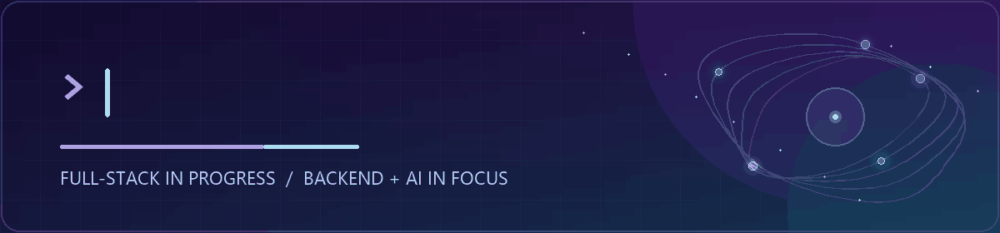

  

Student developer growing toward **full-stack development**, currently exploring **backend systems** and **AI applications** through small, practical projects.

## Current direction

| Growing toward | Currently exploring |
| --- | --- |
| `Full-stack development` | `Java` · `Spring Boot` · `MySQL` · `Redis` · `Docker` · `AI application integration` |

## Building habits

- Strengthening development fundamentals before adding complexity.
- Turning exercises into small, documented projects.
- Keeping progress visible through clear commits and README files.

## Learning archive

### [hello-world](https://github.com/KaiZekai/hello-world)

A personal collection of programming-fundamentals exercises kept as part of the learning process.

---

Learning in public, one useful step at a time.
